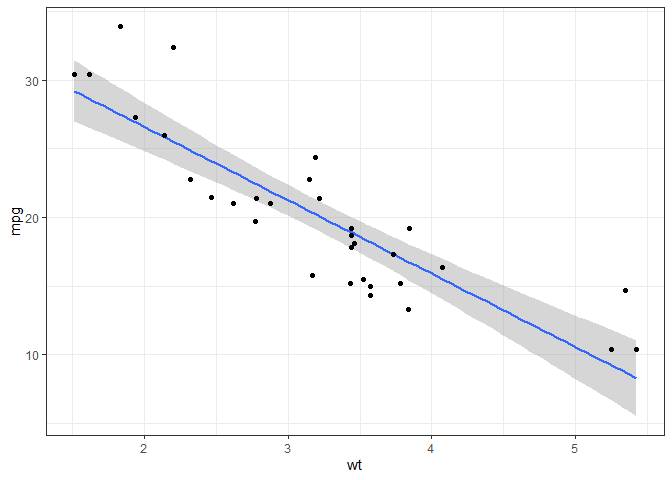

Mailbag de github
================

\##En este repositorio vamos apreder github

    ## Warning: package 'tidyverse' was built under R version 4.2.3

    ## Warning: package 'ggplot2' was built under R version 4.2.3

    ## Warning: package 'readr' was built under R version 4.2.3

    ## Warning: package 'forcats' was built under R version 4.2.3

    ## Warning: package 'lubridate' was built under R version 4.2.3

    ## ── Attaching core tidyverse packages ──────────────────────── tidyverse 2.0.0 ──
    ## ✔ dplyr     1.0.10     ✔ readr     2.1.4 
    ## ✔ forcats   1.0.0      ✔ stringr   1.5.0 
    ## ✔ ggplot2   3.4.2      ✔ tibble    3.1.8 
    ## ✔ lubridate 1.9.2      ✔ tidyr     1.3.0 
    ## ✔ purrr     1.0.1      
    ## ── Conflicts ────────────────────────────────────────── tidyverse_conflicts() ──
    ## ✖ dplyr::filter() masks stats::filter()
    ## ✖ dplyr::lag()    masks stats::lag()
    ## ℹ Use the ]8;;http://conflicted.r-lib.org/conflicted package]8;; to force all conflicts to become errors
    ## `geom_smooth()` using formula = 'y ~ x'

<!-- -->
